```mermaid
graph TD
    A[ShirtCo Cart: $5,454] --> B[🦈 Orca: APPROVE]
    B --> C[🦏 Okra: BNPL 30-day]
    C --> D[💎 Opal: Corp Visa]
    D --> E[🚀 Orion: ACH Payout]
    E --> F[🏛️ Oasis: +$5K Liquidity]
    F --> G[🖤 Onyx: KYB Verified]
    G --> H[🫒 Olive: 5% Gold Discount]
    H --> I[🌊 Weave: Receipts Stored]
```

```mermaid
graph TD
    A[Oxfords + Blazer: $700] --> B[🦈 Orca: APPROVE]
    B --> C[🦈 Orca: Explanation CE]
    C --> D[💎 Opal: Corp Visa]
    D --> E[🫒 Olive: 5% Gold Rebate]
    E --> F[🦏 Okra: BNPL 30-day]
    F --> G[🖤 Onyx: KYB CE]
    G --> H[🌊 Weave: Receipts Logged]
```

# OCN AI Explainability Demo

[](https://github.com/ahsanazmi1/ocn-demo/actions)
[](https://opensource.org/licenses/MIT)

A comprehensive demonstration of AI-powered explainability across the Open Checkout Network (OCN), showcasing deterministic decision engines, CloudEvents integration, and transparent reasoning.

## 🎯 What This Demo Shows

This demo demonstrates the complete AI explainability pipeline:

1. **Orca** (Checkout Decision Engine)
   - Makes deterministic checkout decisions (approve/decline/review)
   - Generates AI-powered explanations with reasoning, signals, and confidence
   - Emits CloudEvents (`ocn.orca.explanation.v1`) with trace IDs

2. **Orion** (Payout Optimization Engine)
   - Optimizes vendor payouts across payment rails (ACH, Wire, RTP, V-Card)
   - Provides deterministic scoring with cost, speed, and limit considerations
   - Emits CloudEvents (`ocn.orion.explanation.v1`) with optimization reasoning

3. **Weave** (Audit & Receipt Engine)
   - Subscribes to CloudEvents from Orca and Orion
   - Stores hash receipts with trace ID correlation
   - Provides audit trails and receipt logging

## 🚀 60-Second Quickstart

```bash
# 1. Clone and setup
git clone https://github.com/ahsanazmi1/ocn-demo.git
cd ocn-demo

# 2. Configure environment
cp .env.example .env
# Edit .env to add OPENAI_API_KEY if you want live LLM explanations

# 3. Initialize submodules and start services
make submodules
make pin
make up

# 4. Wait for services to start, then run demo
sleep 5
make smoke

# 5. View CloudEvents in Weave logs
make logs
```

## 📋 Prerequisites

- **Docker & Docker Compose**: For containerized services
- **Git**: For submodule management
- **Make**: For convenient commands
- **curl**: For API testing (usually pre-installed)
- **jq**: For JSON parsing (optional, but recommended)

### Optional: OpenAI API Key
- Add your `OPENAI_API_KEY` to `.env` for live AI explanations
- Without it, Orca uses deterministic explanation stubs
- The demo works perfectly without an API key

## 🏗️ Architecture

```
┌─────────────┐    CloudEvents     ┌─────────────┐
│    Orca     │ ──────────────────→ │    Weave    │
│ (Checkout)  │    trace_id        │ (Audit)     │
│ Port: 8080  │                     │ Port: 8082  │
└─────────────┘                     └─────────────┘
       ↑                                     ↑
       │                                     │
       │    CloudEvents                     │
       │    trace_id                        │
       │                                     │
┌─────────────┐                     ┌─────────────┐
│    Orion    │ ──────────────────→ │             │
│ (Payout)    │                     │             │
│ Port: 8081  │                     │             │
└─────────────┘                     └─────────────┘
```

## 🛠️ Available Commands

```bash
make help          # Show all available commands
make submodules    # Initialize and update git submodules
make pin           # Pin all submodules to v0.2.0 tags
make up            # Start all services with Docker Compose
make down          # Stop all services and remove volumes
make logs          # Show logs from all services
make smoke         # Run the complete demo smoke test
make demo-shirtco  # Start ShirtCo 8-agent demo (NEW!)
make demo-down     # Stop ShirtCo demo and cleanup
make clean         # Clean up demo outputs and containers
make health        # Check service health status
make health:shirtco # Check all ShirtCo demo services
```

## 📊 What You'll See

### Orca Decision Flow
```json
{
  "outcome": "approve",
  "confidence": 0.85,
  "reason": "Low risk transaction within normal parameters",
  "key_signals": ["amount_below_threshold", "known_merchant", "standard_channel"],
  "trace_id": "demo_trace_orca_001"
}
```

### Orion Optimization Flow
```json
{
  "best_rail": "ach",
  "ranked_rails": [
    {"rail": "ach", "score": 0.85, "cost": 1.50, "speed": "24h"},
    {"rail": "wire", "score": 0.72, "cost": 15.00, "speed": "4h"}
  ],
  "explanation": {
    "reason": "ACH provides optimal cost-benefit ratio",
    "confidence": 0.90
  },
  "trace_id": "demo_trace_orion_001"
}
```

### Weave CloudEvents Logs
```
[INFO] Received CloudEvent: ocn.orca.explanation.v1
[INFO] Subject: demo_trace_orca_001
[INFO] Receipt stored: hash_abc123...

[INFO] Received CloudEvent: ocn.orion.explanation.v1
[INFO] Subject: demo_trace_orion_001
[INFO] Receipt stored: hash_def456...
```

## 🔍 Sample Data

### Checkout Sample (`samples/ap2/checkout_small.json`)
- **Amount**: $125.50
- **MCC**: 5411 (Grocery stores)
- **Channel**: ecommerce
- **Risk Tier**: medium
- **Non-PII**: Safe for demos

### Payout Sample (`samples/vendor/payout_basic.json`)
- **Amount**: $2,500.00
- **Vendor**: Demo Vendor Corp
- **Urgency**: standard
- **Preferred Rails**: ACH, Wire, RTP
- **Cost Limit**: $25.00

## 🐛 Troubleshooting

### Port Conflicts
```bash
# Check what's using ports 8080, 8081, 8082
lsof -i :8080 -i :8081 -i :8082

# Stop conflicting services or change ports in docker-compose.yml
```

### Missing API Key
```bash
# Demo works without OpenAI API key
# Orca will use deterministic explanation stubs
echo "OPENAI_API_KEY=" > .env
```

### Submodule Issues
```bash
# Reset submodules to clean state
make clean
git submodule deinit -f --all
make submodules
make pin
```

### Service Health Issues
```bash
# Check service health
make health

# View detailed logs
make logs

# Restart services
make down
make up
```

### Docker Issues
```bash
# Clean Docker state
docker system prune -f
docker volume prune -f

# Rebuild from scratch
make down
make up
```

## 🔧 Development

### Adding New Samples
1. Create JSON files in `samples/ap2/` or `samples/vendor/`
2. Ensure they contain required fields (`amount`, `trace_id`, etc.)
3. Test with `make smoke`

### Modifying Services
1. Update submodule references in `docker-compose.yml`
2. Pin to new versions with `make pin`
3. Test with `make smoke`

### Customizing the Demo
1. Edit `scripts/smoke_demo.sh` for different API calls
2. Modify sample JSON files for different scenarios
3. Update environment variables in `.env`

## 📚 Related Documentation

- [SUBMODULES.md](SUBMODULES.md) - Git submodule management guide
- [Orca Repository](https://github.com/ahsanazmi1/orca) - Checkout decision engine
- [Orion Repository](https://github.com/ahsanazmi1/orion) - Payout optimization engine
- [Weave Repository](https://github.com/ahsanazmi1/weave) - Audit and receipt engine
- [OCN Common](https://github.com/ahsanazmi1/ocn-common) - Shared schemas and utilities

## 🤝 Contributing

1. Fork the repository
2. Create a feature branch
3. Make your changes
4. Test with `make smoke`
5. Submit a pull request

## 📄 License

This project is licensed under the MIT License - see the [LICENSE](LICENSE) file for details.

## 🆘 Support

- **Issues**: [GitHub Issues](https://github.com/ahsanazmi1/ocn-demo/issues)
- **Discussions**: [GitHub Discussions](https://github.com/ahsanazmi1/ocn-demo/discussions)
- **Documentation**: [Project Wiki](https://github.com/ahsanazmi1/ocn-demo/wiki)

## 👔 ShirtCo: Mid-Market Apparel (All 8 Agents)

The ShirtCo demo showcases a complete B2B transaction flow across all 8 OCN agents, demonstrating enterprise-grade fintech orchestration with deterministic outputs and comprehensive audit trails.

### 🏪 Scenario Overview

**Merchant**: ShirtCo (mid-market apparel retailer)
**Customer**: Acme Dev LLC (B2B, Gold loyalty tier)
**Order**: 3 shirt types, 60 total units, $5,454.00
**Vendor**: CottonSupply LLC (fabric supplier)

### 🚀 Quick Start

```bash
# 1. Setup (same as original demo)
cp .env.example .env
make submodules
make pin

# 2. Launch ShirtCo demo
make demo-shirtco

# 3. Open browser to http://localhost:3000
# 4. Click "Run ShirtCo Demo"
```

### 📋 Agent Flow & Endpoints

| Step | Agent | Endpoint | Purpose | CE Emitted |
|------|-------|----------|---------|------------|
| 1 | 🦈 Orca | `/decision` | Checkout risk & approval | `ocn.orca.explanation.v1` |
| 2 | 🦏 Okra | `/bnpl/quote` | BNPL net-30 underwriting | - |
| 3 | 💎 Opal | `/wallet/select` | Corp Visa selection | - |
| 4 | 🚀 Orion | `/optimize` | ACH payout optimization | `ocn.orion.explanation.v1` |
| 5 | 🏛️ Oasis | `/treasury/plan` | 14-day liquidity forecast | - |
| 6 | 🖤 Onyx | `/kyb/verify` | CottonSupply LLC verification | `ocn.onyx.kyb_verified.v1` |
| 7 | 🫒 Olive | `/incentives/apply` | Gold tier 5% discount | `ocn.olive.incentive_applied.v1` |
| 8 | 🌊 Weave | `/receipts/{trace_id}` | Audit trail storage | - |

### 🎯 Key Features

- **Single Trace ID**: End-to-end correlation across all agents
- **Deterministic Outputs**: Fixed seeds ensure consistent results
- **Real-time UI**: Live status updates and CloudEvents timeline
- **JSON Inspector**: Collapsible response details for each agent
- **Rail Optimization**: ACH selected for cost/speed balance
- **Loyalty Integration**: Automatic Gold tier discount application
- **Audit Compliance**: Hash-only receipts (no PII stored)

### 🌐 Demo UI Components

1. **Order Summary**: Line items, totals, customer info
2. **Agent Status Grid**: 2×4 grid showing health and results
3. **CloudEvents Timeline**: Real-time event tracking with trace ID
4. **JSON Inspectors**: Expandable response data for debugging
5. **System Health**: Port monitoring and service status

### 📊 Sample Transaction Flow



### 🔧 Architecture

```
┌─────────────┐    ┌─────────────┐    ┌─────────────┐
│ ShirtCo UI  │◄──►│   Gateway   │◄──►│   Agents    │
│ Port: 3000  │    │ Port: 8090  │    │ 8080-8087   │
└─────────────┘    └─────────────┘    └─────────────┘
                           │
                           ▼
                   ┌─────────────┐
                   │   Weave     │
                   │ Port: 8082  │
                   │ (Audit)     │
                   └─────────────┘
```

### 🛑 Stopping the Demo

```bash
make demo-down
```

---

## 🎯 Demo 1 — Oxfords Checkout (Phases 0–2)

The Oxfords Checkout demo showcases a streamlined 6-agent flow demonstrating core OCN functionality with deterministic outputs and comprehensive audit trails.

### 🏪 Scenario Overview

**Merchant**: Example LLC (B2B apparel)
**Customer**: Corporate buyer
**Order**: Oxfords (Brown 10D) + Blazer (Navy 40R) = $700.00
**Payment**: Card channel, MCC 5651 (Apparel)

### 🚀 Quick Start

```bash
# 1. Setup (same as other demos)
cp .env.example .env
make submodules
make pin

# 2. Launch Demo 1
make demo-oxfords

# 3. Open http://localhost:3000 → click "Run Demo 1"
```

### 📋 Agent Flow

| Step | Agent | Endpoint | Purpose | CE Emitted |
|------|-------|----------|---------|------------|
| 1 | 🦈 Orca | `/decide` | Checkout decision | - |
| 2 | 🦈 Orca | `/explain?emit_ce=true` | Explanation with CE | `ocn.orca.explanation.v1` |
| 3 | 💎 Opal | `/wallet/methods` → `/wallet/select` | Corp Visa selection | - |
| 4 | 🫒 Olive | `/incentives/apply` | Gold tier 5% rebate | - |
| 5 | 🦏 Okra | `/bnpl/quote` | 30-day BNPL quote | - |
| 6 | 🖤 Onyx | `/kyb/verify?emit_ce=true` | Vendor verification | `ocn.onyx.kyb_verified.v1` |

### 🎯 Key Features

- **Single Trace ID**: End-to-end correlation across all 6 agents
- **Deterministic Outputs**: Fixed samples ensure consistent results
- **CloudEvents Integration**: Orca explanations and Onyx KYB verification
- **Real-time UI**: Live agent status and event timeline
- **JSON Inspectors**: Collapsible response details for debugging
- **No PII**: All samples use synthetic data

### 🌐 Demo UI Components

1. **Order Summary**: Line items, totals, customer info
2. **Agent Status Grid**: 2×3 grid showing health and results
3. **Event Timeline**: Real-time tracking with trace ID
4. **JSON Inspectors**: Expandable response data
5. **System Health**: Port monitoring and service status

### 📊 Sample Transaction Flow



### 🔧 Architecture

```
┌─────────────┐    ┌─────────────┐    ┌─────────────┐
│ Demo 1 UI   │◄──►│   Gateway   │◄──►│   Agents    │
│ Port: 3000  │    │ Port: 8090  │    │ 8080-8087   │
└─────────────┘    └─────────────┘    └─────────────┘
                           │
                           ▼
                   ┌─────────────┐
                   │   Weave     │
                   │ Port: 8082  │
                   │ (Audit)     │
                   └─────────────┘
```

### 🛑 Stopping the Demo

```bash
make demo1-down
```

---

**Ready to see AI explainability in action?** Run `make smoke` for the original demo, `make demo-shirtco` for the full 8-agent experience, or `make demo-oxfords` for the streamlined 6-agent flow! ✨
